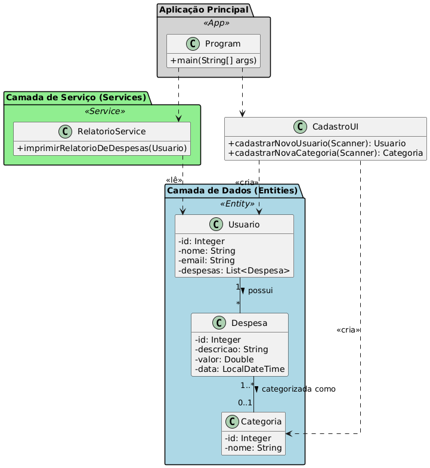

# Projeto 1: Sistema de Gerenciamento de Despesas Pessoais (Console)

Este é um projeto simples de console para gerenciar despesas pessoais, ideal para aplicar conceitos fundamentais de Programação Orientada a Objetos (POO) em Java.

## ✨ Funcionalidades

* **Adicionar Despesa:** Permite ao usuário registrar uma nova despesa com descrição, valor e data.
* **Listar Despesas:** Exibe todas as despesas registradas.
* **Resumo de Gastos:** Mostra o total gasto.
* **(Opcional) Categorizar Despesas:** Permite associar cada despesa a uma categoria (ex: Alimentação, Transporte).

## 🚀 Tecnologias Utilizadas

* **Linguagem:** Java
* **Conceitos de POO:** Classes, Objetos, Encapsulamento.
* **Ferramentas:** Git e GitHub para versionamento.
* **Banco de Dados:** Nenhum (dados armazenados em memória durante a execução).

## ⚙️ Como Executar

1.  Clone o repositório:
    ```bash
    git clone [https://github.com/matquirin0/gerenciamentoDespesasPessoais.git](https://github.com/matquirin0/gerenciamentoDespesasPessoais.git)
    ```
2.  Navegue até o diretório do projeto:
    ```bash
    cd gerenciamentoDespesasPessoais
    ```
3.  Compile os arquivos Java (este passo pode variar dependendo da sua IDE):
    ```bash
    javac *.java
    ```
4.  Execute o programa principal:
    ```bash
    java Program
    ```

## 📊 Diagrama de Classes de Design
